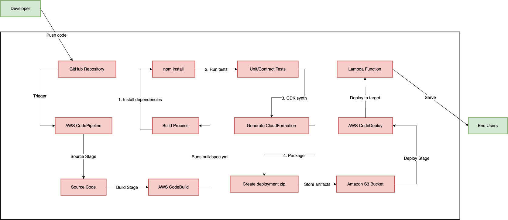

# **Pipeline Implementation Document (PID): CI/CD for Serverless Microservices on AWS**

**1. Overview**

**Purpose:** This document details the implementation of a robust CI/CD pipeline for deploying serverless microservices on AWS, focusing on automation, reliability, and security. It supports the fintech startup's migration from a monolithic architecture to a microservices-based system.

**Scope:** This PID covers the full lifecycle of building, testing, and deploying serverless microservices on AWS, with an emphasis on multi-environment support and rollback strategies.

**Tech Stack:**

* **CI/CD Services:** AWS CodePipeline, AWS CodeBuild, AWS CodeDeploy
* **Infrastructure as Code (IaC):** AWS CDK (with considerations for Terraform)
* **Deployment:** AWS Lambda, Amazon API Gateway
* **Monitoring & Logging:** AWS CloudWatch, AWS X-Ray, AWS SNS
* **Security & Secrets Management:** AWS IAM, AWS Secrets Manager, AWS Parameter Store
* **Multi-Environment Management:** AWS Organizations, AWS Control Tower
* **Testing:** Jest (Unit), Postman/Newman (Integration), Pact (Contract)

**2. Architecture Diagram**



**3. Pipeline Stages & Workflows**

**3.1. Source Stage**

* **Trigger:** A new commit is pushed to the main branch of the GitHub repository.
* **Artifact Storage:** AWS CodePipeline pulls source code and stores artifacts in an S3 bucket.

**3.2. Build Stage (AWS CodeBuild)**

* Installs dependencies, including language-specific packages and testing frameworks.
* Runs unit tests using Jest, generating test reports.
* Runs contract tests using Pact, generating test reports.
* Compiles the application and packages the Lambda function using AWS CDK.
* **Dependency caching:** Implemented to improve build times.

**Example `buildspec.yml` Configuration:**

```yaml
version: 0.2

phases:
  install:
    runtime-versions:
      nodejs: 18
    commands:
      - npm install
      - npm install -g jest pact-cli

  build:
    commands:
      - npm run build
      - npm run test:unit -- --coverage --json > unit-test-results.json
      - pact verify --provider-base-url=http://localhost:3000 --pact-url=./pacts
      - cdk synth --output cdk.out

  post_build:
    commands:
      - cd cdk.out
      - zip -r lambda_function.zip *

artifacts:
  files:
    - '**/*'
  base-directory: cdk.out

reports:
  unit-tests:
    files:
      - 'unit-test-results.json'
    file-format: JSON
```

**3.3. Deploy Stage (AWS CodeDeploy & Lambda)**

* Deploys Lambda functions using AWS CodeDeploy with a Blue/Green deployment strategy.
* Traffic is shifted to the new Lambda version after successful pre-deployment integration tests.
* Automated rollback is triggered if CloudWatch alarms detect high error rates.
* **Blue/Green Implementation:**
    * A new Lambda version is deployed alongside the existing one.
    * API Gateway aliases are used to route traffic to the new version.
    * After successful testing, traffic is shifted entirely to the new version, and the old version is decommissioned.

**AWS CDK Deployment Example:**

```go
deploymentGroup := awscodedeploy.NewLambdaDeploymentGroup(stack, jsii.String("LambdaDeployment"), &awscodedeploy.LambdaDeploymentGroupProps{
    Application:      codeDeployApp,
    Alias:            lambdaAlias,
    DeploymentConfig: awscodedeploy.LambdaDeploymentConfig_LINEAR_10PERCENT_EVERY_1MINUTE()), // Blue/Green
    AutoRollback: &awscodedeploy.AutoRollbackConfig{
        FailedDeployment:  jsii.Bool(true),
        StoppedDeployment: jsii.Bool(true),
        DeploymentInAlarm: jsii.Bool(true),
    },
    Alarms: &[]awscloudwatch.IAlarm{lambdaErrorsAlarm},
})
```

**4. Configuration Details**

* **AWS IAM Roles:** Fine-grained permissions for each stage.
* **AWS S3:** Secure storage for build artifacts.
* **AWS CDK:** Infrastructure provisioning and deployment.
* **AWS Secrets Manager:** Storage of sensitive credentials.
* **AWS Parameter Store:** Storage of application configurations.
* **AWS Organizations & Control Tower:** Centralized management of multi-environment.
* **Environment Variables:** Managed through Parameter Store and Secrets Manager, with environment-specific configurations.
* **VPC and security groups:** Properly configured for network security.

**5. Testing & Rollback Strategy**

**5.1. Testing:**

* **Unit Tests:** Jest is used to test individual components.
* **Contract Tests:** Pact is used to ensure API compatibility between services.
* **Integration Tests:** Postman/Newman is used to test API functionality and interactions.
* **Pre-Deployment Tests:** API Gateway integration and Lambda function responses are validated.
* **Post-Deployment Monitoring:** CloudWatch metrics and X-Ray traces are monitored for anomalies.

**5.2. Rollback Mechanism:**

* **Blue/Green Deployments:** Rapid rollback to the previous version by switching API Gateway aliases.
* **Automated Rollback:** CodeDeploy triggers rollback based on CloudWatch alarms.
* **Manual Rollback:** Detailed procedures are documented for manual rollback via the AWS Console or CLI.

**6. Monitoring & Logging**

* **AWS CloudWatch Logs:** Centralized logging for Lambda, CodeBuild, and CodePipeline.
* **AWS X-Ray:** End-to-end tracing for API Gateway and Lambda functions.
* **AWS SNS:** Real-time alerts for pipeline failures and critical events.
* **CloudWatch Alarms:** Alarms for error rates, latency, and resource utilization.
* **CloudWatch Dashboards:** Visualization of key metrics and alarms.
* **Log aggregation and analysis:** Using CloudWatch log insights.

**7. Common Issues & Troubleshooting**

### **Common Issues & Troubleshooting Table**

| **Issue**                     | **Cause**                                        | **Resolution**                                                                 |
|--------------------------------|-------------------------------------------------|--------------------------------------------------------------------------------|
| **IAM permission errors**      | Incorrect IAM roles for CodePipeline, CodeBuild, or CodeDeploy | Validate IAM role permissions and ensure least privilege access. |
| **AWS CDK synthesis failure**  | Incorrect stack configuration or missing dependencies | Check `cdk.json`, ensure proper dependencies in `package.json` (Node.js) or `go.mod` (Go), and run `cdk doctor`. |
| **AWS CDK deployment failure** | Stack resource conflicts, missing permissions, or API rate limits | Ensure IAM roles have correct permissions, check AWS CloudFormation logs, and verify `cdk bootstrap` is complete. |
| **S3 artifact upload failure** | Incorrect S3 permissions or missing bucket      | Ensure CodePipeline and CodeBuild roles have `s3:PutObject` and `s3:GetObject` permissions. |
| **CodeBuild failure**          | Incorrect `buildspec.yml` file                  | Validate `buildspec.yml` syntax, runtime versions, and dependencies installation. |
| **Slow deployments**           | Large Lambda package size                       | Optimize Lambda package by excluding unnecessary files and using layers for dependencies. |
| **API Gateway deployment failure** | Incorrect Swagger/OpenAPI configuration     | Validate OpenAPI definitions and check deployment stage settings. |
| **Rollback not triggering**    | Misconfigured CloudWatch alarms                 | Ensure alarms detect errors correctly and are linked to rollback actions in CodeDeploy. |
| **High Lambda cold start time**| Large package size or unoptimized dependencies  | Reduce package size, enable provisioned concurrency, and optimize imports. |
| **WebSockets not connecting**  | Incorrect API Gateway WebSocket configuration   | Check route integration settings and ensure IAM policies allow `execute-api` permissions. |
| **Pipeline execution stuck**   | AWS CodePipeline waiting for manual approval    | Check approval stage settings or automate approvals with SNS/Lambda triggers. |
| **Environment variables missing** | AWS Systems Manager Parameter Store issues  | Ensure parameters exist, IAM roles have `ssm:GetParameter`, and use correct paths. |
| **Monitoring not capturing logs** | CloudWatch log group not created or IAM issues | Validate IAM role permissions and confirm log groups are set up correctly. |

---

**8. Edge Cases & Failover**

* **Pipeline Failure Handling:** If a pipeline stage fails, an SNS notification is sent to developers for immediate action.
* **Fallback Strategy:** Manual intervention procedures are documented for critical failures if rollback fails.
* **Scaling Considerations:** Lambda concurrency limits and auto-scaling policies are monitored to prevent throttling.
* **Disaster Recovery:** Backup and restore procedures for critical data and infrastructure.

**9. Summary**

This PID provides a comprehensive framework for implementing a CI/CD pipeline for serverless microservices on AWS. By leveraging AWS-native services, robust testing, and a Blue/Green deployment strategy, the fintech startup can achieve automated, secure, and scalable deployments. Continuous monitoring and logging ensure high availability and rapid issue resolution.