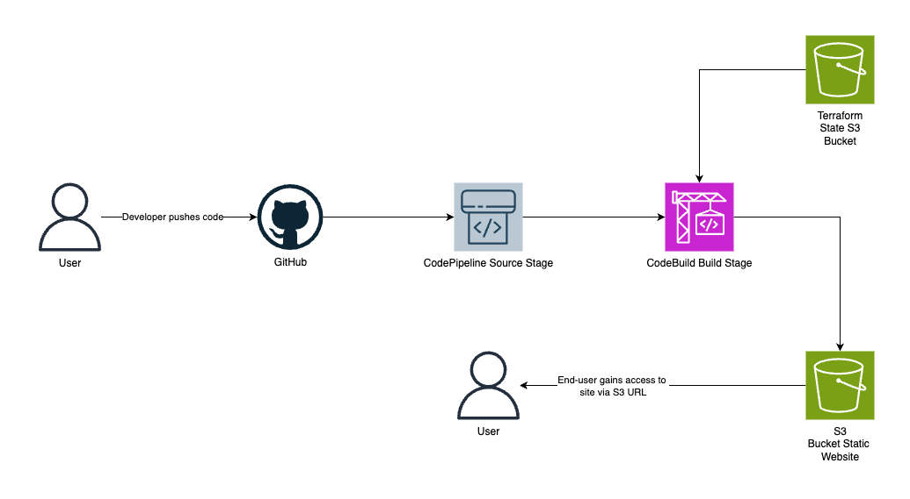

# **Proof of Concept - AWS CI/CD Pipeline with Terraform**

## Objective
- Infrastructure as Code: define AWS resources using Terraform.
- Implement automated deployment of a static website using GitHub and AWS CodePipeline.
- Validation the deployment by verifying the website's accessibility and content. 

## High-Level Architecture
**Workflow:**
- Developer pushes code (static website) to GitHub repository. 
- GitHub push triggers AWS CodePipeline.
- CodePipeline executes a CodeBuild stage, which:
    * runs `terraform init` and `terraform apply` to create/update infrastructure.
    * syncs website files to the S3 bucket. 
- The static website is deployed and accessible via S3's website URL.
- Terraform state is stored in S3 for persistence. 
- The end-user can gain access to said webiste via S3 URL.



## AWS Services Used
- AWS CodePipeline - Automates deployments process.
- AWS CodeBuild - Executes the Terraform commands and copies website files.
- AWS S3 - Hosts the static website and stores the Terraform state. 
- AWS IAM - Manages permissions for CodePipeline, CodeBuild, and S3.
- Terraform - Defines and manage the infrastructure as code. 

## Terraform Code Overview
**Folder Structure:** 

```markdown
📂 terraform-aws-ci-cd
├── 📂 modules
│   ├── 📂 codebuild
│   │   ├── 📜 codebuild.tf
│   │   ├── 📜 iam.tf
│   │   ├── 📜 outputs.tf
│   │   └── 📜 variables.tf
│   ├── 📂 codepipeline
│   │   ├── 📜 codepipeline.tf
│   │   ├── 📜 iam.tf
│   │   ├── 📜 outputs.tf
│   │   └── 📜 variables.tf
│   └── 📂 s3
│       ├── 📜 outputs.tf
│       ├── 📜 s3.tf
│       └── 📜 variables.tf
├── 📜 outputs.tf
├── 📜 provider.tf
├── 📜 main.tf
├── 📜 variables.tf 
└── 📜 buildspec.yaml
```

**Key Resources:**
- `aws_codepipeline`: Defines the CI/CD pipeline.
- `aws_codebuild_project`: Configures the CodeBuild project.
- `aws_s3_bucket`: Creates the S3 bucket for the website.
- `aws_iam_role`: Defines IAM roles for the CodePipeline and CodeBuild.
- `aws_iam_policy`: Defines the IAM policies.
- `aws_iam_role_policy_attachment`: Attaches policies to roles. 

**Code Snippets:**
- *CodePipeline*
```go
resource "aws_codepipeline" "code_pipeline" {
  name = var.codepipeline_name
  role_arn = aws_iam_role.code_pipeline_role.arn 

  artifact_store {
    location = "${var.s3_bucket}/codepipeline-artifacts" 
    type = "S3"
  }

  stage {
    name = "Source"

    action {
      name = "Source"
      category = "Source"
      owner = "AWS"
      provider = "CodeStarSourceConnection"
      version = "1"
      output_artifacts = ["source_output"]

      configuration = {
        ConnectionArn = aws_codestarconnections_connection.github.arn 
        FullRepositoryId = var.repo_id
        BrachName = "main"
      }
    }
  }
  ...
```

- *buildspec*
```yaml
version: 0.2

phases:
  install:
    runtime-versions:
      golang: 1.x
      nodejs: latest
  pre_build:
    commands:
      - echo "Preparing environment..."
      - aws s3 cp s3://terraform-state-bucket/terraform.tfstate terraform.tfstate || echo "No existing state found creating a new one"
      - echo "Initializing Terraform..."
      - terraform init 
  build:
    commands:
      - echo "Starting Terraform apply at ${date}"
      - terraform apply -auto-approve
      - echo "Copying website files to S3"
      - aws s3 sync ./website s3://terraform-state-bucket/website
  post_build:
    commands: 
      - echo "Deployment completed at ${date}"
      - echo "Backing up Terraform state"
      - aws s3 cp terraform.tfstate s3://terraform-state-bucket/terraform.tfstate
      - echo "Build ID: ${CODEBUILD_BUILD_ID}"
artifacts:
  files:
    - terraform.tfstate
    - terraform.tfstate.backup
  discard-paths: yes

cache:
  paths:
    - "/root/.terraform/**/*"
```

**Terraform State Management:**
The Terraform state will be stored in an S3 bucket (terraform-state-bucket) for persistence and collaboration.

- *backend.tf*
```go
terraform {
    backend "s3" {
        bucket          = "terraform-state-bucket"
        key             = "cicd-pipeline/terraform.tfstate"
        region          = var.region
        encrypt         = true 
        dynamodb_table  = "terraform-lock"
    }
}
```

## Validation
- A simple static website (HTML, CSS, Javscript) will be placed in the website/ directory of the GitHub repository.
- After CodePipeline completes, the website will be accessible via the S3 bucket's website endpoint.
- The content of the website will also be validated to ensure it matches the latest commit in the GitHub repository. 
- To validate, the S3 website enpoint will be accessed in the browser, and the displayed content will be compared with the local website files.
- Additionally, the terraform state will be validated to ensure the changes were applied correctly. 

## IAM Details
- CodePipeline Role: Grants CodePipeline permissions to access GitHub, CodeBuild, and S3. 
- CodeBuild Role: Grants CodeBuild permissions to execute Terraform commands and interact with S3.
- S3 Bucket Policy: Allows public read access to the website files.
- Terraform State S3 Bucket Policy: Grants codebuild access to read and write to the state file. 

- *iam.tf*
```go
...
// IAM Policy for CodeBuild to interact with S3
data "aws_iam_policy_document" "codebuild_s3_policy_doc" {
  statement {
    effect = "Allow"
    actions = [ "s3:GetObject", "s3:PutObject", "s3:ListObject" ]
    resources = [
      "arn:aws:s3:::${var.s3_bucket_id}", # Bucket level
      "arn:aws:s3:::${var.s3_bucket_id}/*", # Object level
    ]
  }

  statement {
    effect = "Allow"
    actions = [ "secretsmanager:GetSecretValue" ]
    resources = [ "arn:aws:secretmanager:${var.region}:${data.aws_caller_identity.current.account_id}:secret:token" ]
  }
}
...
```

## Error Handling
- CodePipeline will provide visual feedback on pipeline execution status.
- CloudWatch logs for CodeBuild will be monitored for error messages. 
- CodePipeline notifications can be configured to send email alerts on pipeline failures.

## Cleanup
- To clean up the resources, run:
    * `terraform destroy` from the directory containing the Terraform files.
- Delete the S3 buckets used for the website and Terraform state.
- Delete the CodePipeline and CodeBuild projects.
- Delete the IAM roles. 

## Out of Scope
- Advanced website functionality (e.g., dynamic content, backend integration).
- Thorough testing of the website's functionality.
- Detailed performance testing.
- Complex networking setups.